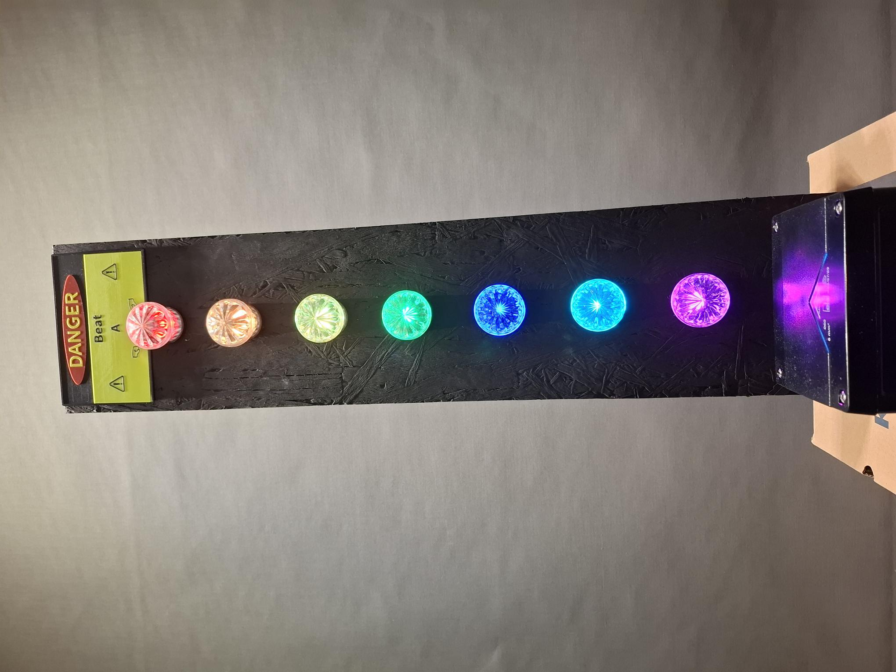

# Beat-A-Box 🎵🥊  
Ein Reaktions- und Geschicklichkeitsspiel mit MPU6050 und NeoPixel-LEDs

Beat-A-Box ist ein kleines Arduino-Spiel, das auf Bewegungserkennung basiert.  
Der Spieler muss im richtigen Moment „zuschlagen“, während ein grünes Licht über eine LED-Leiste wandert.  
Trifft der Schlag genau auf die Zielposition, geht es ins nächste Level – immer schneller, immer schwieriger.

---

## 🚀 Features
- Bewegungserkennung über **MPU6050**
- LED-Animationen über **Adafruit NeoPixel**
- Akustisches Feedback über Buzzer
- 7 Schwierigkeitsstufen

---

## 🛠️ Hardware
- Arduino (Uno, Nano oder kompatibel)
- MPU6050 Gyro-/Beschleunigungssensor
- NeoPixel LED-Streifen (7 LEDs)
- Piezo-Buzzer
- Jumper-Kabel

---

## 📦 Verwendete Libraries & Lizenzen

| Library | Autor | Lizenz |
|--------|--------|--------|
| Adafruit_MPU6050 | Adafruit | BSD License |
| Adafruit_Sensor | Adafruit | BSD License |
| Adafruit_NeoPixel | Adafruit | LGPL |
| Wire (Arduino Core) | Arduino | LGPL |

Alle Lizenzen findest du im Ordner **/third_party_licenses** oder über die offiziellen GitHub-Repositories.

---

## ▶️ Installation
1. Arduino IDE öffnen  
2. Benötigte Libraries installieren  
3. Code hochladen  
4. Strom anschließen  
5. Zuschlagen!

---

## 📄 Lizenz
Dieses Projekt steht unter der **MIT-Lizenz**.  

---

## 🙌 Credits
Entwickelt von BigFM-GH  
Unterstützt durch Microsoft Copilot 😉

------------------------------------------------

# Beat-A-Box 🎵🥊  
A reaction-based motion game using MPU6050 and NeoPixel LEDs

Beat-A-Box is a small Arduino game based on motion detection.  
A green LED moves across the strip, and the player must "punch" at the right moment.  
If the punch hits the target position, the game advances to the next level — faster and harder each time.

---

## 🚀 Features
- Motion detection via **MPU6050**
- LED animations using **Adafruit NeoPixel**
- Acoustic feedback via buzzer
- 7 difficulty levels

---

## 🛠️ Hardware
- Arduino (Uno, Nano or compatible)
- MPU6050 gyro/accelerometer
- NeoPixel LED strip (7 LEDs)
- Piezo buzzer
- Jumper wires

---

## 📦 Used Libraries & Licenses

| Library | Author | License |
|--------|--------|---------|
| Adafruit_MPU6050 | Adafruit | BSD License |
| Adafruit_Sensor | Adafruit | BSD License |
| Adafruit_NeoPixel | Adafruit | LGPL |
| Wire (Arduino Core) | Arduino | LGPL |

All licenses are included in the **/third_party_licenses** folder or available via the official GitHub repositories.

---

## ▶️ Installation
1. Open Arduino IDE  
2. Install required libraries  
3. Upload the code  
4. Power the board  
5. Punch!

---

## 📄 License
This project is released under the **MIT License**.

---

## 🙌 Credits
Developed by BigFM-GH  
Supported by Microsoft Copilot
